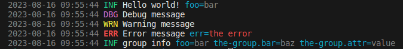
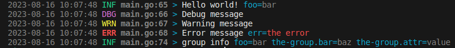

# console-slog

[](https://godoc.org/github.com/phsym/console-slog) [](https://raw.githubusercontent.com/phsym/console-slog/master/LICENSE) [](https://github.com/phsym/zeroslog/actions/workflows/go.yml)

A handler for slog that prints colorized logs, similar to zerolog's console writer output

## Example
```go
package main

import (
	"errors"
	"log/slog"
	"os"

	"github.com/phsym/console-slog"
)

func main() {
	logger := slog.New(
		console.NewHandler(os.Stderr, &console.HandlerOptions{Level: slog.LevelDebug}),
	)
	slog.SetDefault(logger)
	slog.Info("Hello world!", "foo", "bar")
	slog.Debug("Debug message")
	slog.Warn("Warning message")
	slog.Error("Error message", "err", errors.New("the error"))

	logger = logger.With("foo", "bar").
		WithGroup("the-group").
		With("bar", "baz")

	logger.Info("group info", "attr", "value")
}
```



When setting `console.HandlerOptions.AddSource` to `true`:
```go
console.NewHandler(os.Stderr, &console.HandlerOptions{Level: slog.LevelDebug, AddSource: true})
```
